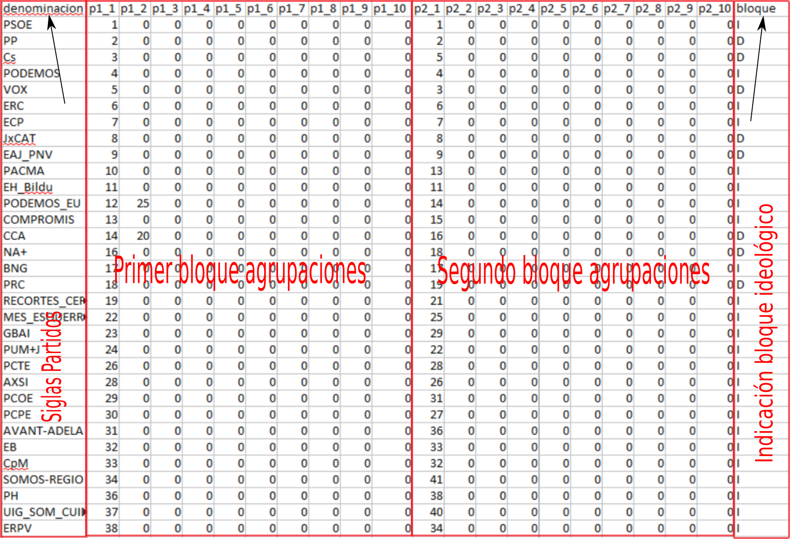

```{r setup, include = FALSE}
knitr::opts_chunk$set(
  collapse = TRUE,
  comment = "#>"
)
```

# Introducción.

Otra de las dimensiones electorales que adquiere especial relevancia en el análisis de los estudios electorales es la que se le conoce con el nombre de **volatilidad**, y que básicamente lo que pretende medir es cómo cambia el comportamiento electoral de los votantes de un proceso electoral a otro, y en definitiva el nivel de fidelidad de los electores en relación con sus representantes democráticamente elegidos. Establecido el concepto, la dificultad viene en la forma de medir el mismo, dado el amplio campo que se quiere abarcar.

En el año 1979 fue Pederson quien propuso la fórmula que permite su cálculo y cuya expresión matemática es
la siguente:

$$VT=\frac{1}{2}\sum_{i=1}^{n}\left|\triangle p_{i}\right| $$
Donde se denota por $\triangle p_{i}$ el incrememto o disminción de apoyos electorales entre dos elecciones expresado en porcentaje de voto. 

aunque existen otros enfoques diferentes que pretenden igualmente medir esa magnitud. En este sentido, también se puede hacer la medición individual del cambio del voto de cada elector[^1](En este caso se estaría calculando un volatilidad totalmente desagregada donde se manifestaría con claridad los cambios de tendencia del electorado, la dificultad en ese caso vendría de la imposibilidad de obtener esa información a ese nivel de detalle, pues para conseguir ese objetivo se necesitaría realizar un censo completo, requiriendo para ello un esfuerzo desproporcionado para conseguir el objetivo marcado),  para acercarnos a ese ideal, sería posible poder disponer de encuestas que nos den una aproximación del problema. Uno de los estudios estadísticos que nos podría facilitar esta información se puede encontrar en los barómetros de opinión que periódicamente publica el CIS ([Centro Investigaciones Sociológicas](http://www.cis.es/cis/opencms/ES/index.html){target="_blank"} ), en los cuales se suele incluir una pregunta sobre la intención de voto del informante y cual fue el partido político al que votó en anteriores elecciones. Con la cautela suficiente y aunque sólo sea para obtener un valor estimado de la realidad que se quiere medir, se podría hacer un cruce de estas dos variables y de esta forma poder obtener una aproximación de la volatilidad individual del electorado.

Tal y como queda expuesto por parte de Oñate y Ocaña ( 1999 ), la **volatilidad agregada (VT)**, se ha visto posteriormente descompuesta en otras dos componentes, que vienen a clarificar y complementar las posibles conclusiones que se puedan tener por medio de la volatilidad agregada. 
Por un lado se tendría la **volatilidad entre bloques (VB)** que intenta medir cómo ha sido el cambio de voto entre dos bloque ideológicos (como por ejemplo derecha-izquierda, o incluso centro-periferia).La medida de esta magnitud se realiza mediante la siguiente fórmula:

$$VB=\frac{\left|\triangle p_{i}+...+\triangle p_{k}\right|}{2}+\frac{\left|\triangle p_{x}+...\triangle p_{z}\right|}{2} $$
Indicando con i...k los partidos clasificados dentro de un bloque y por x...z los correspondientes al otro bloque.

La otra componente de la volatilidad total o agregada se denomina **Volatilidad Intrabloques (VIB)** que inteta medir los cambios de apoyos electorales o parlamentarios habidos dentro de cada bolque ideológico considerado. Em modo de calcular su valor es mdiante la expresión:
$$ VIB = VT -VB $$

# Cálculo de la volatilidad.

El valor que puedan tener estos indicadores no es fácil de obtener y dado que implica la comparación de ddos procesos electorales se necesia tener unos datos que permitan hacer la comparación entre los dos procesos considerados.Para que poder establecer esa relación entre los dos procesos hay que tener en cuenta los siguientes aspectos:

* Hay que enlazar los partidos o agrupaciones de los mismos entre los dos periodos de tiempo.
* Pueden existir partidos que sólo estén en un periodo, bien porque desaparezcan o sean de nueva creación.
* Puede que un partido o coalición se desagregue en otros grupos entre los dos periodos de tiempo.

En el paquete *Relectoral* se ha implementado la función denominada *volatilidada()*, que tiene un parámetro denominado *enlace* y es el que hace referencia a un data.frame que contiene los datos que van a permitir hacer las comparaciones entre los dos procesos electorales, cuya estructura se va a detallar posteriormente.

Los parámetros que hay que facilitar a la función *volatilidad()* son los siguientes:

1.- Un primer dataframe constituido por dos columnas. La primera contiene la denominación de los partidos y la segunda los votos/escaños . Esta información se refiere al primer periodo de comparación. Si se pasan votos se obtendrá la volatilidad electoral, y si se le pasan escaños se obtendrá la volatilidad parlamentaria.

2.- Un segundo dataframe constituido por dos columnas. La primera contiene la denominación de los partidos y la segunda los votos/escaños. Los datos se corresponderán con los resultados obtenidos en la segunda votación.

3.- Un tercer dataframe que servirá de enlace entre los dos anteriores. Su denominación genérica es «enlace», y dado que su estructura presenta una mayor complejidad, a continuación se pasa a realizar una descripción más detallada del mismo.

El resultado es una lista con dos objetos. El primero es la volatilidad total, y el segundo la volatilidad entre-bloques.

Para tratar de exponer mejor cómo debe ser la estructura del dataframe referenciado en el parámetro «enlace», se ha creado la siguiente figura ,que pretende aclarar por completo, cómo debe quedar la estructura de los datos a procesar.

{ width=100% }

Como puede verse, el formato de este data.frame puede dividirse en cuatro apartados. El primero queda constituido por las denominaciones de los partidos o agrupaciones. El segundo apartado está constituido por 10 columnas con denominaciones «p1_i» para i=1,2,...10. El tercer apartado también queda configurado por otras columnas con denominaciones «p2_i» para i=1,2,...,10, y el último apartado esta constituido por una sola columna con denominación «bloque» y debe contener los valores «D» ó «I» para indicar que el partido situado en la primera columna pertenece a un bloque u otro. 

Los dos apartados centrales, son los que identifican y relacionan los votos/escaños de ambos procesos electorales, para un mismo partido político o agrupación de la siguiente manera. En la zona de la izquierda se indica el/los números de los registros del primer dataframe que van a tenerse en cuenta para enlazarse con los números de los registros que figuran en la zona de la derecha, para una misma fila. Cuando no se necesiten las 10 columnas habilitadas para esto, se rellenarán con ceros las columnas sobrantes. Así por ejemplo en la figura anterior, la primera fila, indica que se trata del PSOE, que la primera fila del primer dataframe se debe enlazar con la primera fila del segundo dataframe. Para el caso del partido «Cs», se indica que la tercera fila del primer dataframe, debe enlazarse con la quinta fila del segundo dataframe. El caso de «PODEMOS_EU» indica un tratamiento especial, pues se está indicando que se tomen las filas 12 y 25 del primer.dataframe, se sumen sus votos/escaños, y después se comparen con los datos de la fila 14 del segundo dataframe.

Como al final de estos enlaces, no todos los partidos quedarán enlazados, se habilitará una especie de «cajón de sastre» con dos registros añadidos, y denominado por ejemplo «resto_I» y «resto_D» ( serían las denominaciones a colocar en la primera columna), de tal manera que el primero recoja partidos de ideología del bloque I y el segundo partidos de ideologías del bloque D. Después en cada apartado de información se indicarían los números de los registros de estos partidos no enlazados en la forma que se ha indicado anteriormente y de esta manera se agruparían estos restos de partidos, que por otra parte van a tener escasa o nula relevancia para el cálculo de la volatilidad buscada, ya que los votos obtenidos serían escasos, y por lo tanto nulo el número de escaños. 

# Ejemplo de uso

En este ejemplo se va a calcular la volatilidad estimada entre los las elecciones de abril y mayo que se realizaron en España para elegir los 350 diputados que constituyen el Congreso español.

Para obtener estos resultados, lo primero que debemos tener es el número total de votos o de escaños de 
cada uno de los partidos que se presentaron en esos comicios. Para obtener este dato, se ha utilizado los
datos que de forma gratuita proporciona el Ministerio del Interior español ( MIR ). Estos datos se pueden 
conseguir vía este enlace [http://www.infoelectoral.mir.es/infoelectoral/min/](http://www.infoelectoral.mir.es/infoelectoral/min/){target="_blank"}. En la página a la que se accede se deben elegir las elecciones a cada uno de los dos comicios indicados anteriormente.

De esta manera se descargarán dos ficheros excell ( con la finalidad de poder leerlos en R se les ha pasado a ficheros con extensión .xlsx ), los cuales se pueden leer desde R con la siguiente instrucción:

```{r}
if (!require("readxl")) install.packages("readxl");require("readxl")
dat1<-read_xlsx("../inst/data_raw/volatilidad/abril_19.xlsx",col_names = T)
dat2<-read_xlsx("../inst/data_raw/volatilidad/noviembre_19.xlsx",col_names = T)
```
Y si miramos los primeros datos de uno de estos ficheros, se puede observar lo siguiente:

```{r}
head(dat1)
```

Ahora con cada uno de estos ficheros, se deben obtener el total de votos de cada partido (si se quiere la versión electoral), o el total de escaños conseguidos ( si se quiere la versión parlamentaria ). Para el caso de la **versión electoral**, se obtendrán los siguientes datos:

```{r}
dat1_electoral<-dat1[,c(1,3)]
dat2_electoral<-dat2[,c(1,3)]
```

En el caso de que se quiera conseguir la versión parlamentaria del índice, se deberán tener en cuenta los siguientes datos:

```{r}
dat1_parlamentaria<-dat1[,c(1,7)]
dat2_palamentaria<-dat2[,c(1,7)]
```

Y ahora queda por generar el fichero denominado "enlace", con la estructura que ya se ha comentado en el apartado anterior. La verdad es que esta es la parte más delicada a la hora de calcular este indicador. En este caso concrteo, a continuación se muestra el fichero que se ha tenido en cuenta para este ejemplo, y que por cuestiones meramente didácticas, se muestra en su totalidad.

```{r}
enlace <- read.csv("../inst/data_raw/volatilidad/abril_noviembre_2019.csv",
                   header = T,sep=";", stringsAsFactors = FALSE)
enlace
```

Para ayudar en la generación de este fichero .csv, lo que se ha hecho en primer lugar es construir esta estructura en hoja hoja de cálculo excel y posteriormente se ha exportado la misma a este fichero de tipo csv.

Ahora ya se tienen todo los ingredientes para poder calcular las volatilidades. Comenzamos por la volatilidad electoral y para ello lo que se ha ejecutado es el siguiente código.

```{r}
# Cargamos el paquete Relectoral
if (!require("Relectoral")) install.packages("Relectoral"); require("Relectoral")
s<-volatilidad(dat1_electoral,dat2_electoral,enlace)
```

Entonces la volatilidad total será:

```{r}
s$Total
```

Mientras que la volatilidad entre bloques, será la siguiente:

```{r}
s$Entre
```

Finalmente, la volatilidad intrabloques, como ya se ha indicado antes, será la diferencia de estas dos cantidades.

Para el cálculo de la volatilidad parlamentaria, el proceso de cálculo es similar y se haría de la siguiente manera:

```{r}
s1<-volatilidad(dat1_parlamentaria,dat2_palamentaria,enlace)
s1$Total
s1$Entre
```


